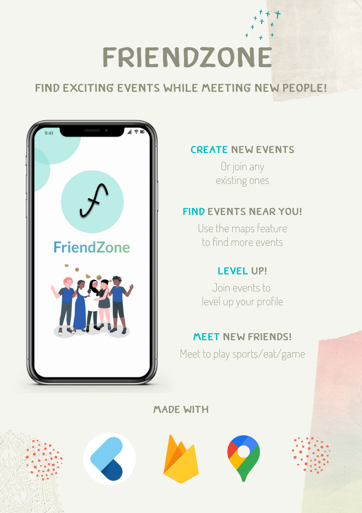

# FriendZone

Team Name: **Ariera** <br>
Proposed level of achievement: **Artemis** <br>

<p align="center">
  <a href="assets/docs/milestone_3/final_poster.png">
    
  </a>
</p>
  
<p align="center">
  Promotional poster
</p>

# About
FriendZone is an interactive and user-friendly platform for users to find like-minded people and meet up for various events.

# Installation
1. Use android studio to run an emulator and run the app in dev mode OR
2. ```flutter build apk``` to build the apk and install the apk on a device. The apk is available at ```build/app/outputs/flutter-apk/apk-release.apk```

# Key Features


* **Find events around you**
  * Search event by event name
  * Indicate your interest
  * Confirm your attendance
  * Join the event telegram group

</br></br></br></br></br></br></br></br></br></br></br>


* **Create a new event**
  * Create an event you love 
  * Choose the timing and location
  * Set the maximum number of people

</br></br></br></br></br></br></br></br></br></br></br></br>


* **Let others know you better**
  * Add profile picture
  * Display your faculty
  * Showcase events attended

</br></br></br></br></br></br></br></br></br></br></br></br>


* **Get points (FriendZ) and level up**
  * Join events to get FriendZ
  * Create events to get even more FriendZ
  * Show off your level and title in your profile page

</br></br></br></br></br></br></br></br></br></br></br></br>

# User Guide
Refer to our file user_guide.pdf for information on how to use our app.

# Built with
* [Flutter](https://flutter.dev/)
* [Firebase](https://firebase.google.com/)
* [Google Maps Platform](https://developers.google.com/maps)
