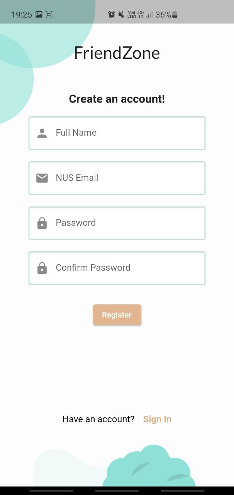
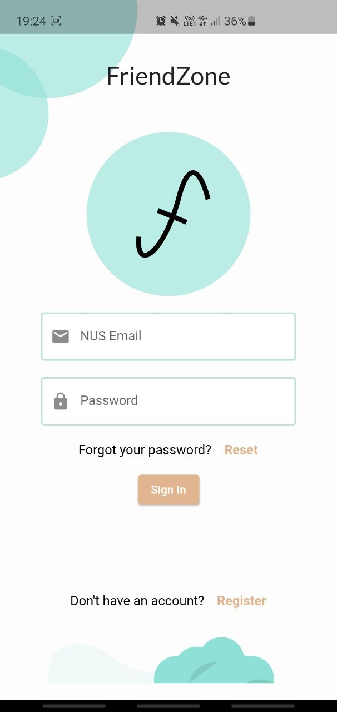
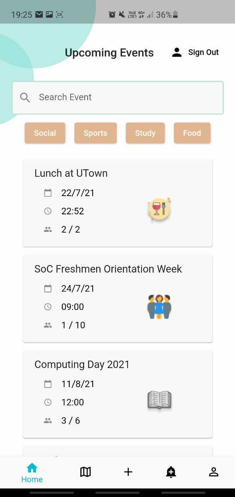
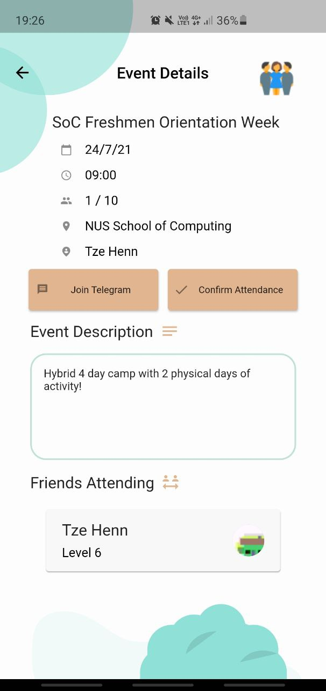
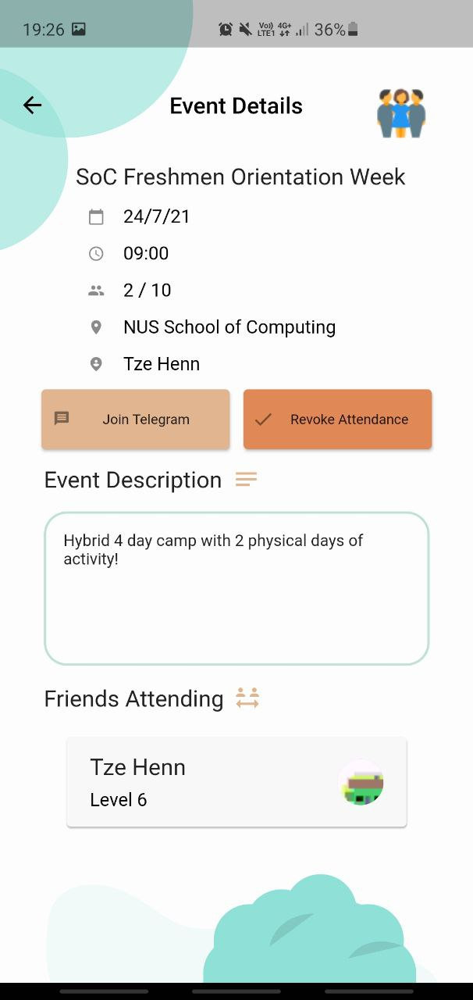
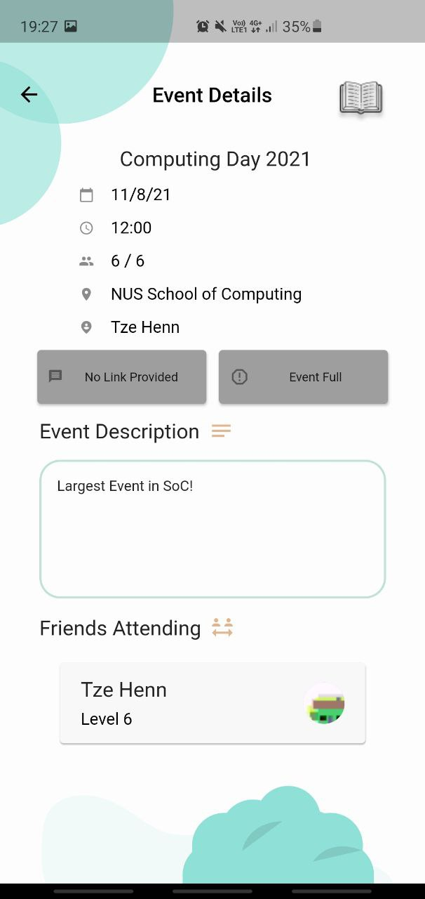
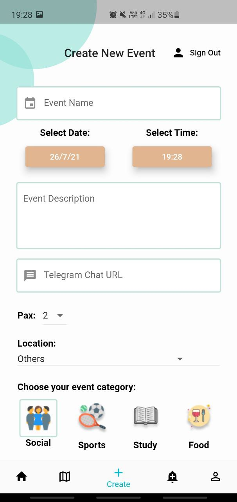
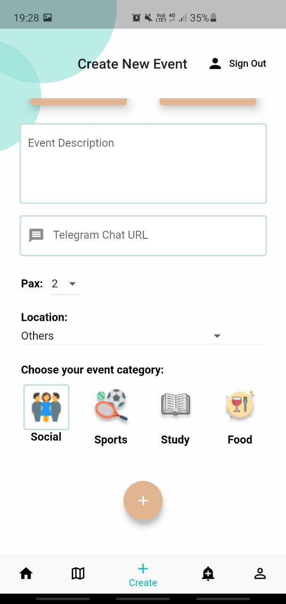
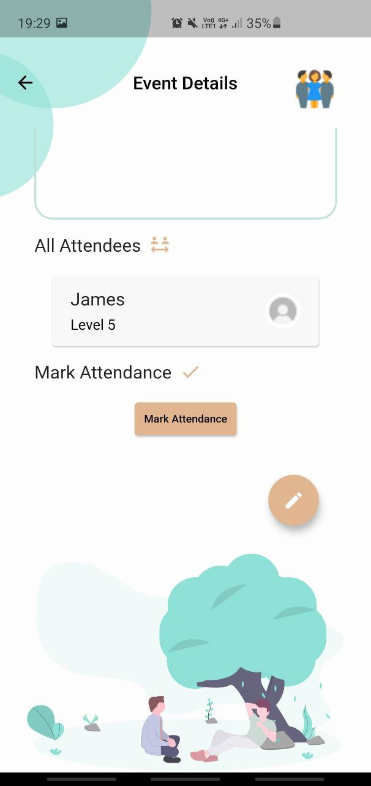
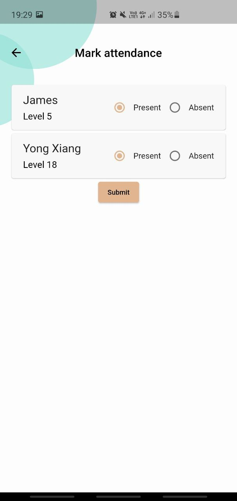

# FriendZone

Team Name: **Ariera** <br>
Proposed level of achievement: **Artemis** <br>

<p align="center">
  <a href="https://github.com/Superbestron/Orbital_2021_FriendZone/blob/master/assets/docs/milestone_2/poster.png">
    
  </a>
</p>
  
<p align="center">
  Promotional poster
</p>

# About
FriendZone is an interactive and user-friendly platform for users to find like-minded people and meet up for various events.

# Installation
1. Use android studio to run an emulator and run the app in dev mode OR
2. ```flutter run build``` to build the apk and install the apk on a device

# Key Features


* **Find events around you**
  * Search event by event name
  * Indicate your interest
  * Confirm your attendance
  * Join the event telegram group

</br></br></br></br></br></br></br></br></br></br></br>


* **Create a new event**
  * Create an event you love 
  * Choose the timing and location
  * Set the maximum number of people

</br></br></br></br></br></br></br></br></br></br></br></br>


* **Let others know you better**
  * Add profile picture
  * Display your faculty
  * Showcase events attended

</br></br></br></br></br></br></br></br></br></br></br></br>


* **Get points (FriendZ) and level up**
  * Join events to get FriendZ
  * Create events to get even more FriendZ
  * Show off your level and title in your profile page

</br></br></br></br></br></br></br></br></br></br></br></br>

# User's Guide
In this guide, we will walk through the activities that you can do with FriendZone, as well as some of its core functionalities.

## Creating an account
In order to view, join and create events, you need to have a FriendZone account. Register for an account using your email and password. By creating an account, you also get the following benefits:

  * Ability to add friends
  * Notifications of event changes and friend requests
  * History of past events attended and a display of upcoming signed up events
  * Have your own profile page to display to other users

<p align="center">
   
</p>

Provide your **Full Name**, **Email Address** and **Password** to create a new account. Your name and email address cannot be empty, and your password must be at least 6-characters long. Ensure that both passwords entered are the same. Tap on “Register” to create your account. If you want to return to the Sign In page, tap on "Back to Sign In".

## Logging into your account
If you already have an account, you can simply log into your account with your email and password. Tap “Sign In” to continue.
<p align="center">
   
</p>

## Navigating the Event List Page
The Event List Page is the main “Home page” of FriendZone. All the upcoming events available for sign up are displayed. The user can scroll further down to see more events. 

   * There is a search bar at the top of the page for you to search for a particular event based on **Name**, **Date**, **Time** and **Description** 
   * Each event card shows various details of the event such as **Name**, **Date**, **Time**, **Current** number of users attending, **Maximum** number of attendees and an event **Icon**
   * Each event card is tappable and tapping it will bring you to the Event Details screen.
   
At the bottom of the screen is the Navigation Bar. There are 5 possible main pages for you to navigate to: Home, Maps, Create Event, Notifications and Profile Page. Tapping on these buttons will bring you to the respective screens

<p align="center">
   
</p>

## Joining (or Un-Joining) an Event
After you have tapped on an event that you are interested to attend, you will be brought to the Event Details page. Here, even more event details are shown, like the event **Initiator** and **Description**. If you have friends that have already signed up for this event, it will be displayed as a tappable card with their **Name**, **Level** and **Profile Picture**. Tapping on the card will bring you to that particular user’s profile page.

<p align="center">
   
</p>

There are 2 buttons shown on the page, “Join Telegram” and “Confirm Attendance”. Tapping on “Join Telegram” will pop up a web link that brings you to the event telegram group chat, where you can chat with the event initiator or with other potential attendees. When you tap on “Confirm Attendance”, a dialog box will pop up, asking you if you want to confirm your attendance for the event. If you tap on “Confirm”, the event pax will be updated with your attendance and it will be immediately reflected on the event page. Consequently, the button will change colour to a lighter orange and the button text will change to “Revoke Attendance”.

<p align="center">
   
</p>

If you click on “Confirm”, the event pax will be updated with your attendance and it will be immediately reflected on the event page. Consequently, the button will change colour to a lighter orange and the button text will change to “Revoke Attendance”.

<p align="center">
   
</p>

In the case where you have any last-minute plans and you cannot participate in the event that you have signed up for, simply tap on the “Revoke Attendance” button and a dialog box will pop up, asking you if you want to revoke your attendance for the event. If you tap on “Confirm”, the event pax will be updated with your withdrawal and it will be immediately reflected on the event page. _**Take note** that withdrawals are only possible if the current time is more than 48 hours away from the event to give others sufficient time to replace your slot._

<p align="center">
   
</p>

If maximum capacity for a particular event is reached, instead of an orange button with a “Confirm Attendance” text, a grey button with an “Event Full” text will be shown, and tapping on it will give an error.

<p align="center">
   
</p>

## Maps
The Maps screen can be accessed via tapping on the “Maps” tab. Upon clicking the tab, the user would have to authorise tha application to use their location. If access is granted, a google-maps widget would be rendered and the user's location shown. The user would be able to see events near them as indicated by markers on the map. When the markers are clicked, a detailed view of the event is shown where the user can confirm their attendance.

<p align="center">
  
</p>

## Create Event
The Create Event screen can be accessed via tapping on the “Create Event” tab. You have the ability to create a new event. Simply fill up the details of the event with its **Name**, **Date**, **Time**, **Description**, **Telegram Link** (optional), **Pax** limit, **Location** and event **Icon**. The default date, time, pax and icon are listed below respectively if you do not decide to change it. 

  * **Date**: 7 days away from the date now
  * **Time**: Time now
  * **Pax**: 2
  * **Location**: Others (Note that this option would mean that your event will not show up on Maps)
  * **Icon**: First Icon from the left

<p align="center">
  
  
</p>

For the rest of the other fields, it cannot be left blank except for the telegram link. Simply leave the telegram link field blank if you do not wish to create a Telegram group for this event. Otherwise, the link must begin with “t.me/joinchat/” in order for it to be valid. 

[Refer to Telegram FAQ](https://telegram.org/faq#:~:text=It%20is%20easy%20to%20migrate,group%20by%20following%20this%20link) if you are unsure of how to get the link from Telegram. 

Once you are done entering the event details, tap on the pencil button to create an event and a snackbar will pop up from the bottom of the page, indicating success. However, if you realised that you had made a mistake in entering the event details, quickly press the “undo” button on the snackbar to delete the event immediately. The snackbar will disappear automatically after 4 seconds.

## Edit Event
If you are the initiator of a particular event, you can tap on that event via the Event List page, which will bring you to the event page page. A pencil button will appear at the bottom right hand corner of the page. Tapping that button will bring you to a page where you can edit the details of the event. _**Take note** that only certain fields are changeable and you will not be allowed to edit the event if it is less than 48 hours away from the event start time._ After you have made your changes, tap on the check button to save your changes. You can even delete the event by tapping on the trash button. Changing the event details or deleting the event completely will automatically send a notification to all signed up attendees so only do so sparingly. The changes will be automatically reflected. You may double-check in the Event List page whether the event details have been changed or whether the event has been deleted by tapping on the “Home” tab.

<p align="center">
  
  
</p>

## Mark Attendance
Once the event has passed, the initiator will be able to see a button to mark the attendance when the initiator views the event page. After submitting the attendance, users who turn up for the event will be awarded 50 FriendZ points while those who are absent will be penalised with 20 FriendZ points.

<p align="center">
  
  
</p>

## Notifications
The Notifications page can be accessed via tapping on the “Notifications” tab. You can see your notifications on the top of the page (if you have any). There are generally 2 types of notifications: Event Changes and Friends-related requests. For event changes, you can tap on the notification to view the updated event details. For friend-related requests, tapping on it will bring you to the user’s profile page. To delete notifications, simply swipe the notification left or right off the page. As of now, yellow notifications mean a change in event details, red notifications mean an event deletion while green notifications mean friend-related notifications.

<p align="center">
   
</p>

Your created events are shown to make it easier for you to view your editable events.

Upcoming events are also shown with a countdown timer to remind you of your impending signed up events. Tapping on the event card will bring you to the Event Details screen.

Past events that you have attended are shown below as well. You will be able to see the list of all attendees if you tap on the event card. Here you can choose to add them as friends.

<p align="center">
 
 
</p>

## Personal Profile
The Profile screen can be accessed via tapping on the “Profile” tab. You can see your own profile details here. You may edit your profile details by tapping on the pencil icon near your profile picture, which will bring you to the “Edit Profile” page. 

<p align="center">
   
</p>

Here, you can upload a new **Profile Picture**, change your **Name**, **Faculty** and **Biography**. Tapping on the “Remove Profile Image” button will remove your current saved profile picture if you want to use the default profile picture (a greyed body). After you are done editing your profile details, tap on the “Save” button to save your changes.

<p align="center">
   
  
</p>

## Friends’ Profiles
This has a similar layout to your personal profile but depending on whether you are friends with the user, there will be different buttons shown below the user’s name. 

If you are not friends with that user yet, you have the option to add him as a friend by tapping the “Add Friend” button. A friend request notification will be sent to him.

<p align="center">
  
  
</p>

If you have received a friend request from that user, you have the option to accept his friend request by tapping the “Accept Friend Request” button. After tapping the button, both of you will become friends and you will be able to see each other's profiles appear in the “Friends Attending” section of the Event Details page if both of you have signed up for the same event.

<p align="center">
   
</p>

## Logout
If you want to log out of your account, tap the “Logout” button on the top right corner located at every main page (Home, Maps, Create Event, Notifications, Profile). You will be brought back to the login page.

<p align="center">
   
</p>

# Built with
* [Flutter](https://flutter.dev/)
* [Firebase](https://firebase.google.com/)
* [Google Maps Platform](https://developers.google.com/maps)
